# Results

Full results for the 22 networks (11 dense, 11 convolutional) trained on
CIFAR-10 and evaluated on the 10,000-image test set.

> **Note:** The figures referenced below are taken from the original
> thesis; their axis labels and captions are in Spanish, although the figures
> are accompanied by a new explanatory caption in English.

As a reference point, average **human performance** on CIFAR-10 is **94%**
accuracy[*](https://karpathy.github.io/2011/04/27/manually-classifying-cifar10/).
None of the 22 networks reached this level — the best was at least
13.3% less effective than a human.

---

## 1. Effectiveness (classification accuracy)

CNNs were clearly more effective than dense networks. The convolutional group
sits in the ~68–81% range, while dense networks fall in the ~29–59% range.
**10 of the 11 CNNs** were at least **9.11% more accurate** than the dense
networks, indicating a stronger ability to capture abstract patterns and
generalize. See figures 5.1 and 5.2.

<figure>
  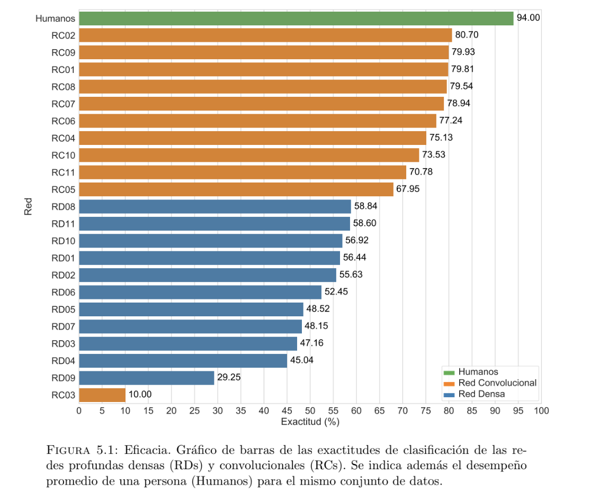
  <figcaption><em>Figure 5.1 — Classification accuracy (%) of dense (RD) and convolutional (RC) networks. Average human performance (94%) is shown for reference.</em></figcaption>
</figure>

<figure>
  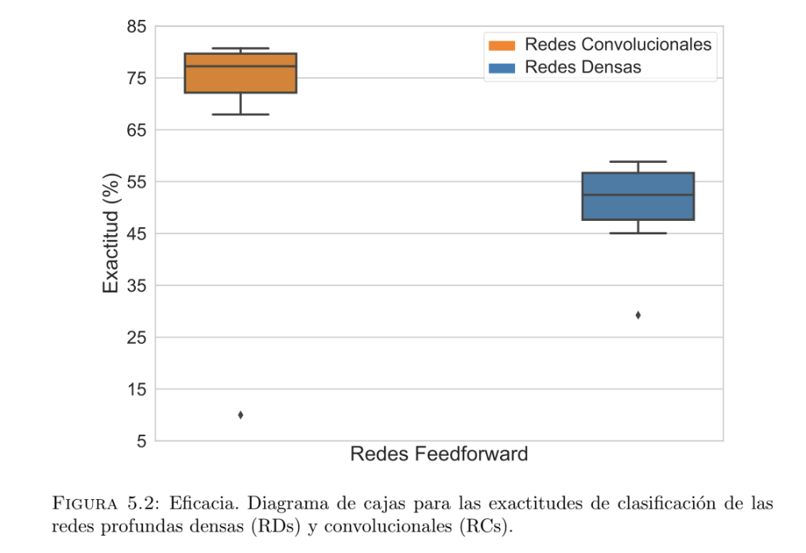
  <figcaption><em>Figure 5.2 — Distribution of classification accuracy for dense (RD) vs. convolutional (RC) networks.</em></figcaption>
</figure>

The single exception is **RC03**, which failed to train under this setup
(10.00%, i.e. chance level), despite reaching ~90% in the original paper
(Springenberg et al., 2014).

Five of the 22 networks were based on previously published architectures (Figure 5.3). Their
accuracies compared to the reported values as follows:

| Network | Source | This study (%) | Difference |
|---------|--------|----------------|------------|
| RC02 | Zeiler & Fergus (2013) | 80.70 | −0.06% |
| RC03 | Springenberg et al. (2014) | 10.00 | −80.26% |
| RD01 | Ba & Caruana (2013) | 56.44 | +14.24% |
| RD02 | Lin et al. (2015) | 55.63 | +1.71% |
| RD03 | Lin et al. (2015) | 47.16 | −9.68% |

RD01 and RD02 improved on their published results, and RC02 closely matched.
RC03 and RD03 underperformed — the training setup was not optimal for those two
networks. It is worth noting that the architectures were replicated; however,
detailed information on hyperparameters is not usually available. Therefore,
the differences may be due to variations in the training protocols.

<figure>
  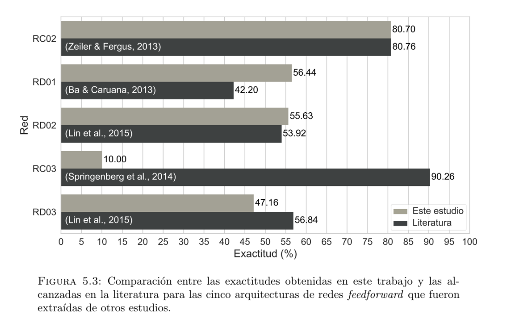
  <figcaption><em>Figure 5.3 — Comparison between the accuracies obtained in this study and those reported in the literature, for the five architectures taken from other works.</em></figcaption>
</figure>

---

## 2. Efficiency (training time)

Dense networks were considerably faster to train. Most finished in under 25
minutes, while several CNNs took well over an hour. **9 of the 11 dense
networks** were at least **6.4 min more efficient** than the CNNs. See
figures 5.5 and 5.6.

<figure>
  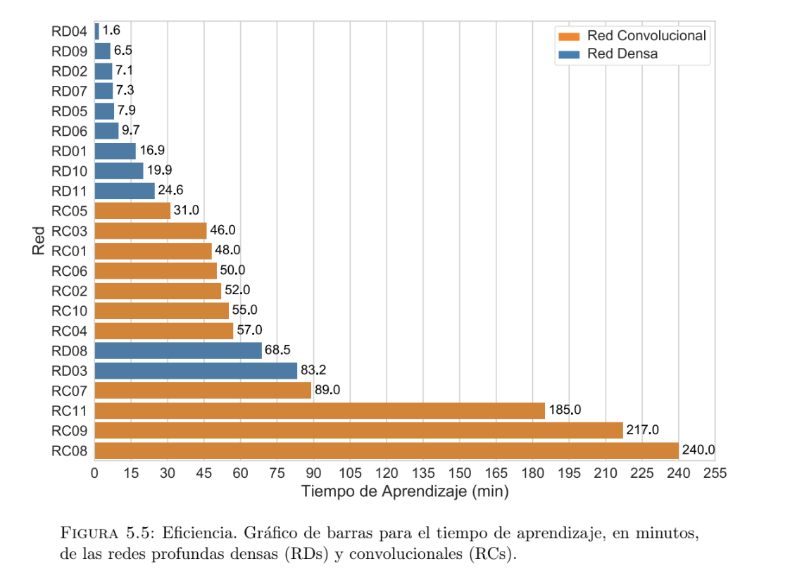
  <figcaption><em>Figure 5.5 — Training time (minutes) for dense (RD) and convolutional (RC) networks.</em></figcaption>
</figure>

<figure>
  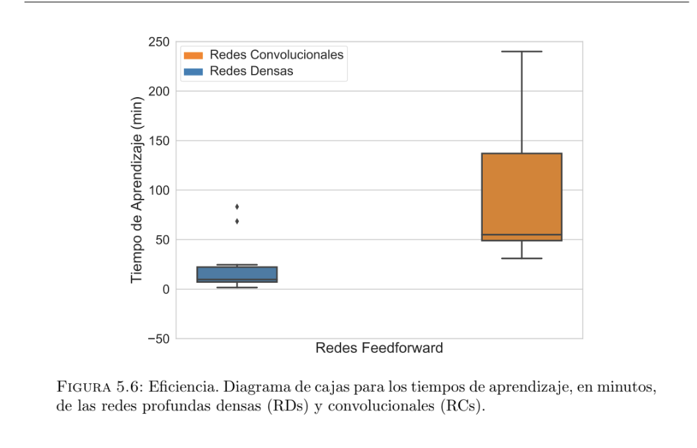
  <figcaption><em>Figure 5.6 — Distribution of training time for dense (RD) vs. convolutional (RC) networks.</em></figcaption>
</figure>

## 3. Capacity: parameters and hidden units

A key structural difference explains the trade-off: CNNs have **far more hidden
units** but **far fewer parameters** than dense networks, thanks to local
connectivity and parameter sharing.

### 3.1. Number of parameters (millions)

**82%** of the CNNs had fewer parameters to learn than the dense networks. See
figures 5.7 and 5.8.

<figure>
  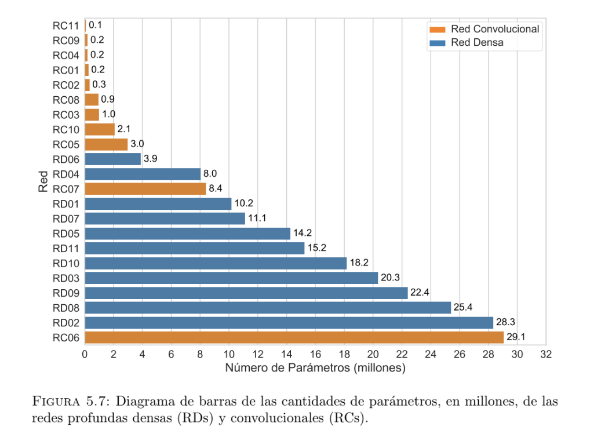
  <figcaption><em>Figure 5.7 — Number of parameters (millions) for dense (RD) and convolutional (RC) networks.</em></figcaption>
</figure>

<figure>
  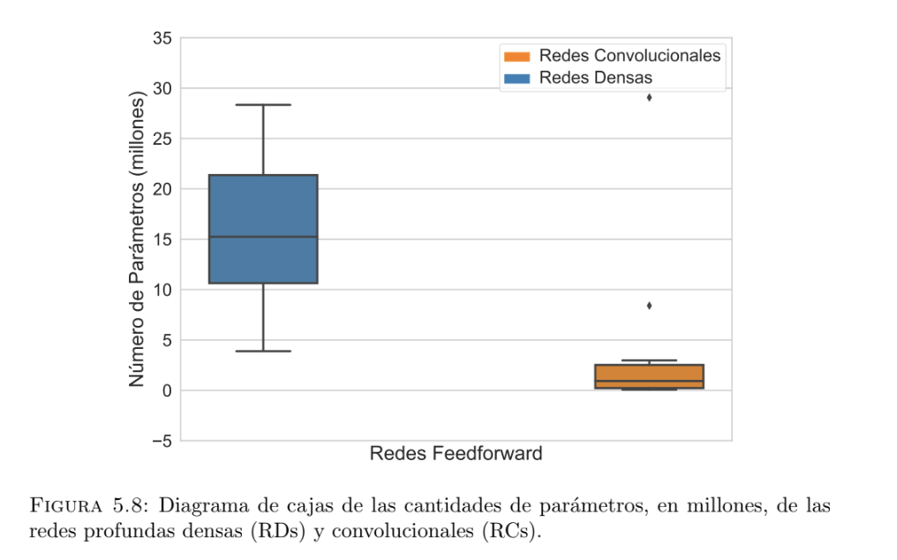
  <figcaption><em>Figure 5.8 — Distribution of the number of parameters (millions) for dense (RD) vs. convolutional (RC) networks.</em></figcaption>
</figure>

### 3.2. Number of hidden units (thousands)

**All** CNNs had more hidden units than the dense networks. See figures 5.9 and 5.10.

<figure>
  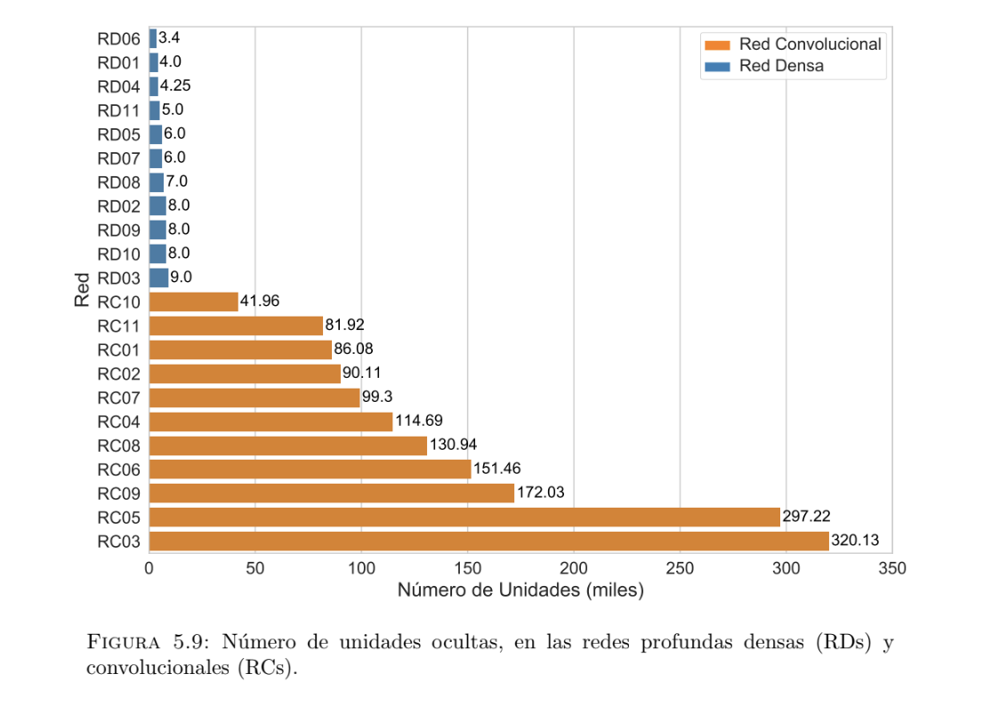
  <figcaption><em>Figure 5.9 — Number of hidden units (thousands) for dense (RD) and convolutional (RC) networks.</em></figcaption>
</figure>

<figure>
  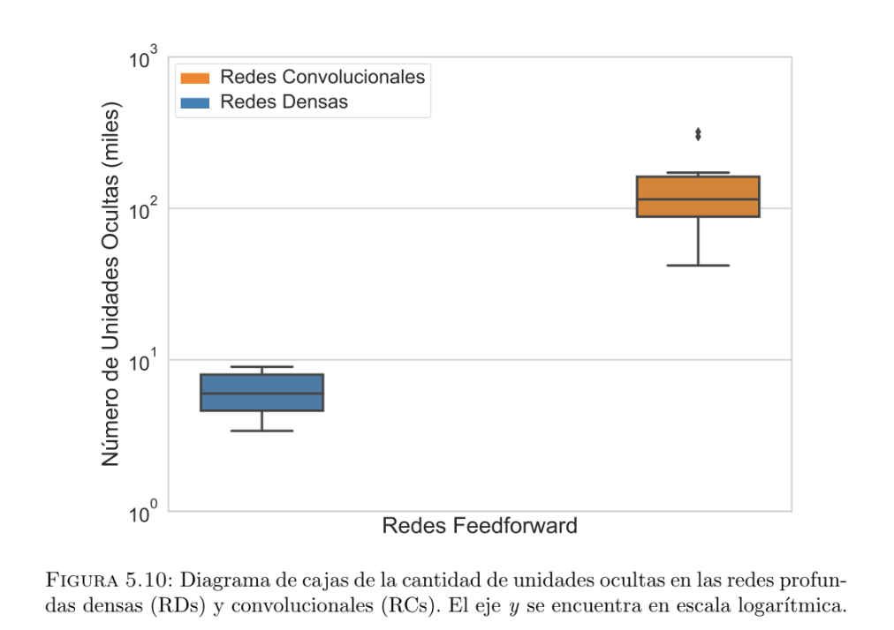
  <figcaption><em>Figure 5.10 — Distribution of the number of hidden units (thousands) for dense (RD) vs. convolutional (RC) networks.</em></figcaption>
</figure>

Figure 5.11 shows the relationship between the number of hidden units and the number of parameters.

<figure>
  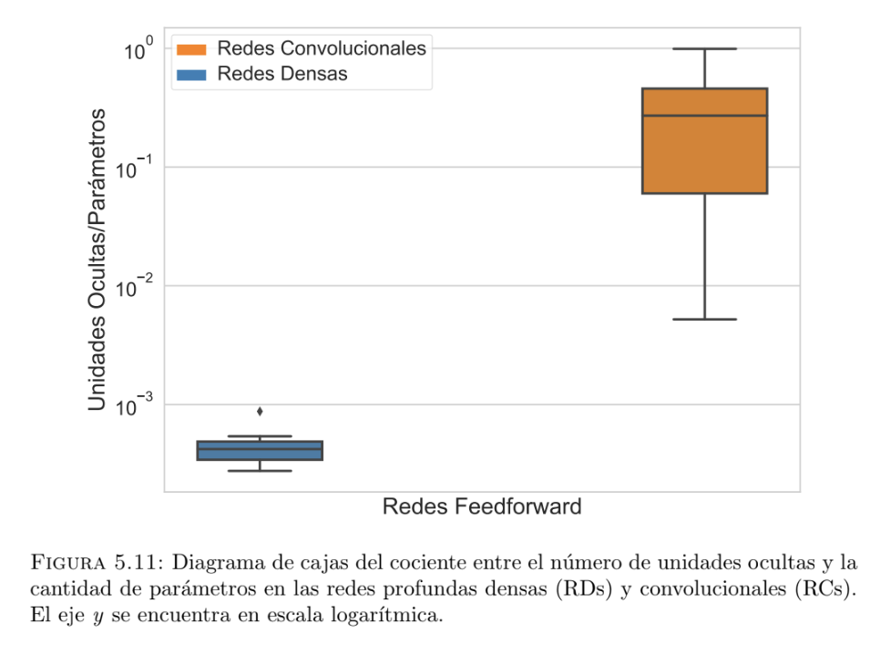
  <figcaption><em>Figure 5.11 — Ratio of hidden units to parameters for dense (RD) vs. convolutional (RC) networks. CNNs pack far more units per parameter.</em></figcaption>
</figure>

## 4. Correlations between performance and structure

Within each model type the correlations were unclear: networks with similar
parameter or unit counts often reached different accuracies, and vice versa. 
See figures 5.12, 5.13, 5.14, 5.15 and 5.16. Across the full set of networks,
however, some general trends emerged:

- More parameters → lower effectiveness (slight trend).
- More hidden units → higher effectiveness (slight trend).
- More parameters → lower efficiency (longer training).
- More hidden units → lower efficiency (longer training).

<figure>
  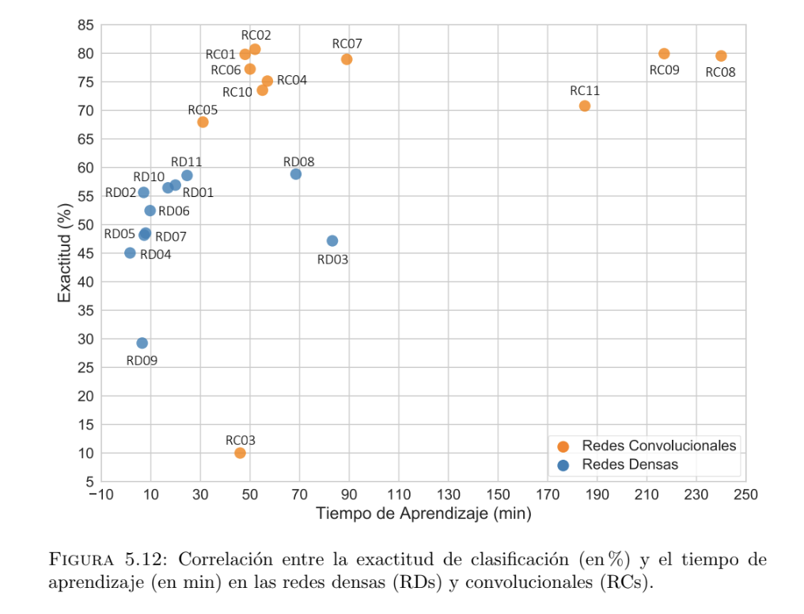
  <figcaption><em>Figure 5.12 — Correlation between classification accuracy (%) and training time (min) for dense (RD) and convolutional (RC) networks.</em></figcaption>
</figure>

<figure>
  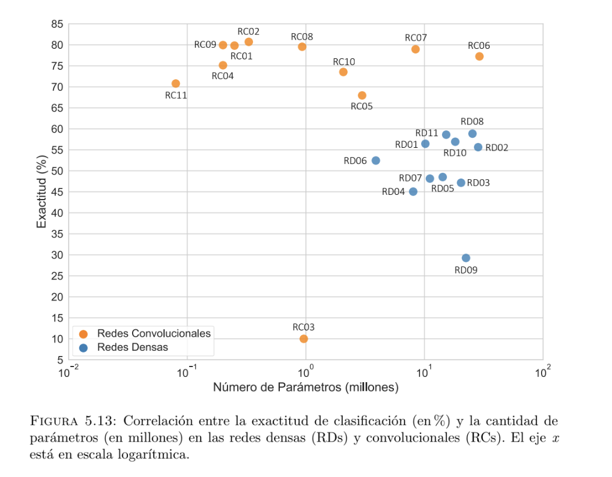
  <figcaption><em>Figure 5.13 — Correlation between accuracy (%) and number of parameters (millions). The x-axis is logarithmic.</em></figcaption>
</figure>

<figure>
  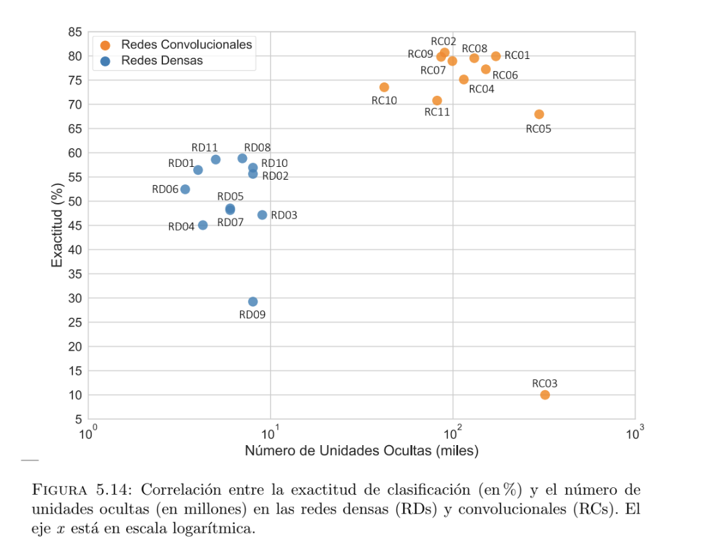
  <figcaption><em>Figure 5.14 — Correlation between accuracy (%) and number of hidden units (thousands). The x-axis is logarithmic.</em></figcaption>
</figure>

<figure>
  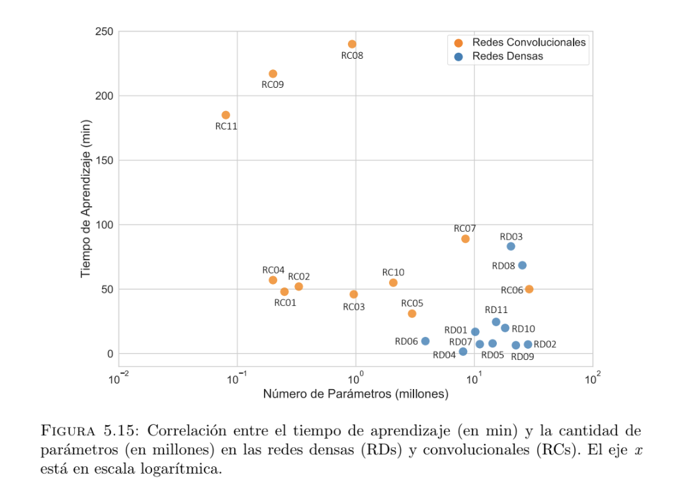
  <figcaption><em>Figure 5.15 — Correlation between training time (min) and number of parameters (millions). The x-axis is logarithmic.</em></figcaption>
</figure>

<figure>
  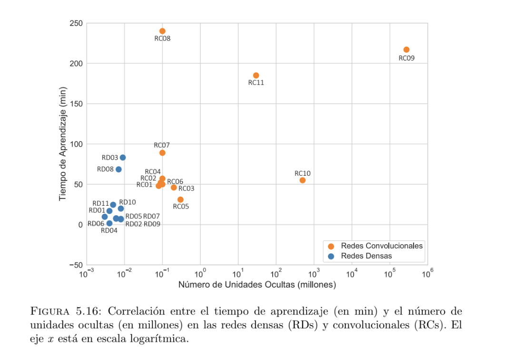
  <figcaption><em>Figure 5.16 — Correlation between training time (min) and number of hidden units (millions). The x-axis is logarithmic.</em></figcaption>
</figure>

---

## 5. Summary

- CNNs were consistently **more effective** but **less efficient** than dense
  networks — a clear effectiveness–efficiency trade-off.
- 10 of 11 CNNs were at least 9.11% more accurate; 9 of 11 dense networks
  trained at least 6.4 min faster.
- The trade-off is driven by structure: CNNs have far more hidden units yet far
  fewer parameters, thanks to local connectivity and parameter sharing.
- Networks reproduced from the literature matched their reported accuracies
  closely, except RC03, which failed to train in this setup.
